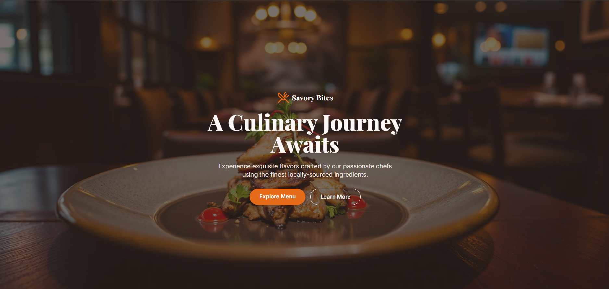
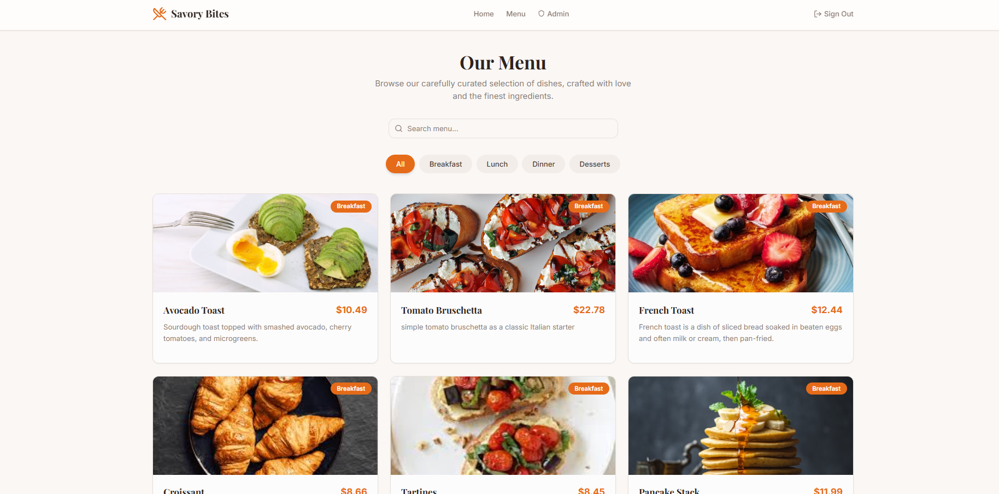
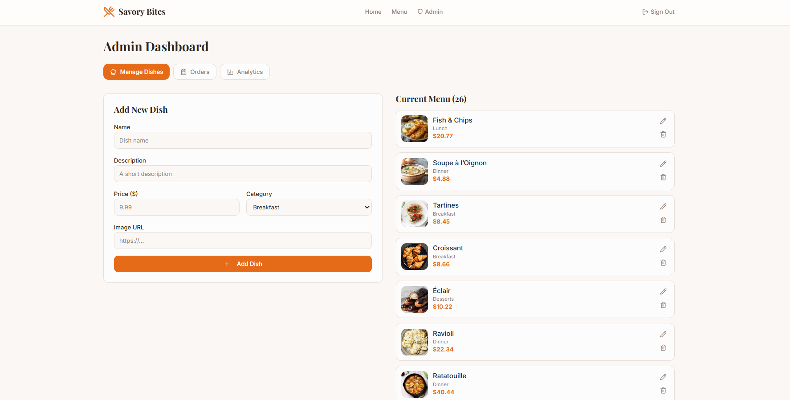

# Savory Bites - Restaurant Menu & Ordering Application

A modern, full-stack restaurant ordering web application built with React, TypeScript, and Supabase. Customers can browse the menu, manage a shopping cart, and place orders, while admins can manage dishes, view orders, and track analytics.

---

## User Interface

### Landing Page
<!-- Add screenshot: landing/hero page -->


### Menu Browsing
<!-- Add screenshot: menu page with category filters -->


### Admin Dashboard
<!-- Add screenshot: individual menu item card -->



---

## Features

- **Menu Browsing** - Browse items across Breakfast, Lunch, Dinner, and Desserts categories with search and filtering
- **Shopping Cart** - Add/remove items, adjust quantities, and view totals
- **Checkout** - Delivery details form with payment processing
- **User Authentication** - Sign up, login, and logout via Supabase Auth
- **Role-Based Access** - Separate user and admin experiences
- **Admin Dashboard** - Manage menu items, view orders, and monitor analytics
- **Toast Notifications** - Real-time feedback for user actions
- **Responsive Design** - Mobile-first layout optimized for all screen sizes

## Tech Stack

| Layer       | Technology                            |
|-------------|---------------------------------------|
| Framework   | React 18 + TypeScript                 |
| Build Tool  | Vite                                  |
| Styling     | Tailwind CSS + Shadcn/ui              |
| Routing     | React Router v6                       |
| State       | React Context API + TanStack Query    |
| Forms       | React Hook Form                       |
| Backend     | Supabase (PostgreSQL + Auth)          |
| Charts      | Recharts                              |
| Testing     | Vitest + Playwright                   |

## Project Structure

```
src/
├── pages/               # Route pages (Landing, Menu, Cart, Checkout, Login, Signup, Admin)
├── components/
│   ├── admin/           # Admin dashboard components
│   ├── ui/              # Shadcn/ui component library
│   ├── MenuCard.tsx     # Menu item display card
│   ├── CategoryFilter.tsx
│   ├── SiteNavbar.tsx
│   └── HeroSection.tsx
├── context/
│   ├── CartContext.tsx   # Shopping cart state
│   └── AuthContext.tsx   # Auth & role state
├── integrations/
│   └── supabase/        # Supabase client & types
├── data/
│   └── menuItems.ts     # Sample menu data
├── hooks/               # Custom React hooks
├── lib/                 # Utility functions
├── assets/              # Static images
└── test/                # Test setup & specs
```

## Getting Started

### Prerequisites

- Node.js (v18+) or Bun
- A Supabase project (for authentication and database)

### Installation

```bash
# Clone the repository
git clone <repository-url>
cd HCI_mini_project

# Install dependencies
npm install
# or
bun install
```

### Environment Variables

Create a `.env` file in the project root:

```
VITE_SUPABASE_URL=your_supabase_url
VITE_SUPABASE_PUBLISHABLE_KEY=your_supabase_anon_key
```

### Running the App

```bash
# Start the development server
npm run dev

# Build for production
npm run build

# Run tests
npm run test
```

The dev server starts at `http://localhost:8080`.


